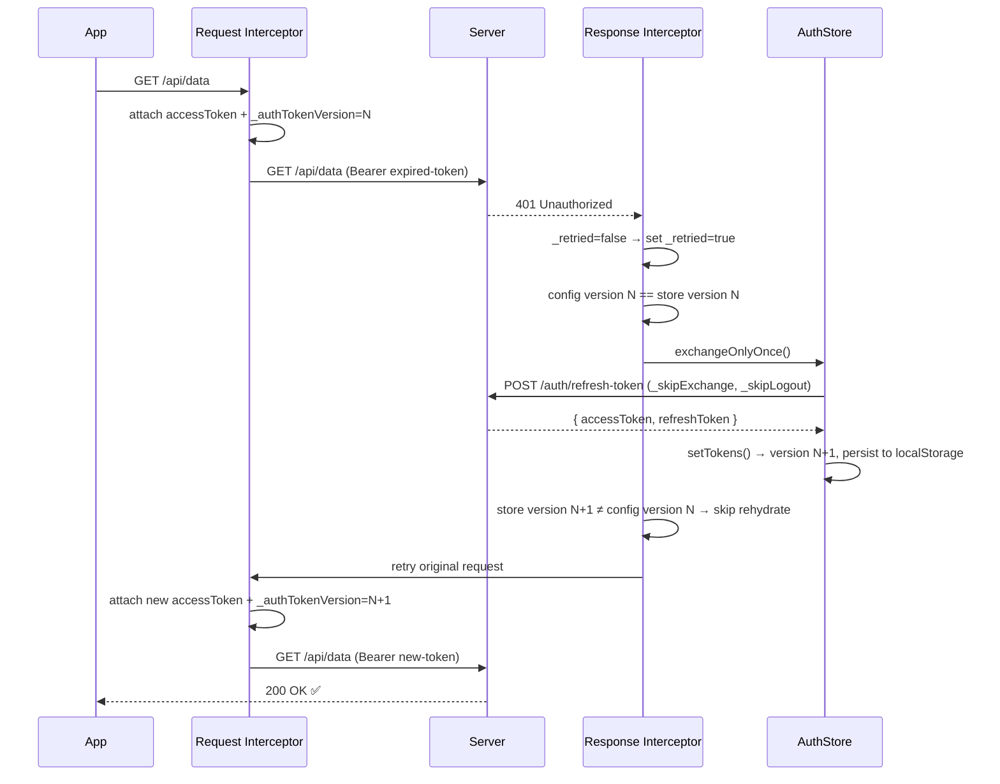
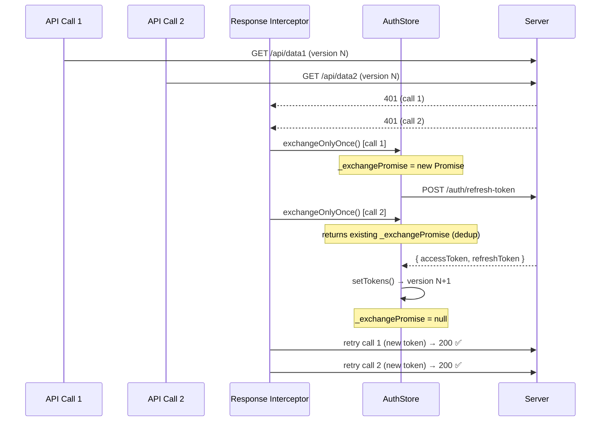
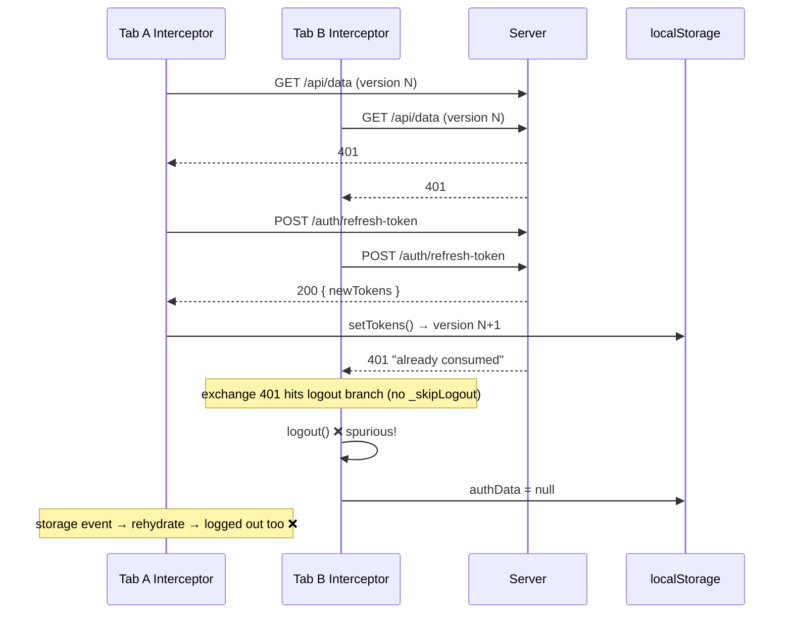
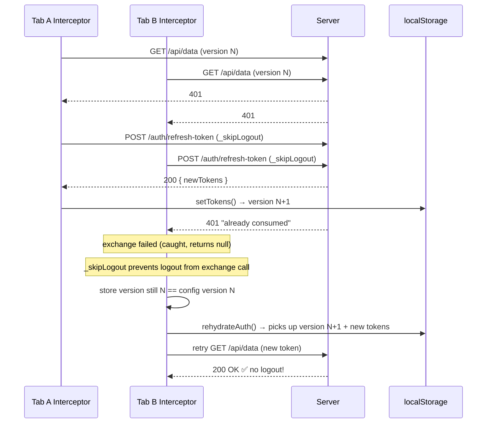
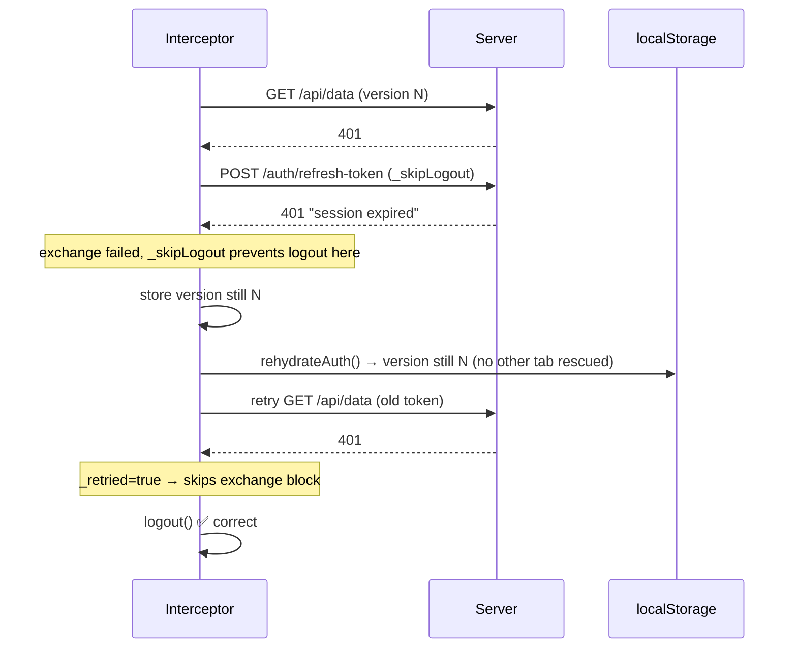

# Token Exchange Flow

How the HTTP interceptor handles 401 responses and token refresh, including cross-tab coordination.

## Scenario 1: Happy Path — Exchange Succeeds



## Scenario 2: Multiple Calls in One Tab — Dedup via \_exchangePromise



## Scenario 3: Cross-Tab Race — Before Fix (Spurious Logout)



## Scenario 4: Cross-Tab Race — With Fix (Rehydrate Rescues)



## Scenario 5: Truly Invalid Session — Correct Logout



## Future Consideration: Web Locks API for Cross-Tab Exchange Dedup

Currently each tab independently attempts the exchange; if it fails, it rehydrates from localStorage to pick up tokens another tab may have refreshed. This works but means N tabs make N exchange calls to the server, N-1 of which will fail.

An alternative is to use the **Web Locks API** (`navigator.locks.request`) so only one tab performs the exchange while others wait:

```
Tab A: acquires lock → exchange → writes tokens → releases lock
Tab B: waits for lock → acquires → sees fresh tokens → skips exchange → rehydrate
```

### How it would work

1. Wrap `exchangeOnlyOnce` in `navigator.locks.request('app:token-exchange', callback)`
2. Inside the callback, check if tokens are already fresh (another tab just finished) — if so, skip
3. Otherwise perform the exchange and write tokens
4. Lock auto-releases when the callback returns
5. Other tabs' awaiting `locks.request` resolves, they rehydrate

### Trade-offs

| Pro                                        | Con                                                                                         |
| ------------------------------------------ | ------------------------------------------------------------------------------------------- |
| Only 1 exchange call hits the server       | Slightly more complex code                                                                  |
| Other tabs wait naturally (no wasted 401s) | Need `AbortSignal.timeout()` for hung-tab protection                                        |
| No tab ID management needed                | Keep `_exchangePromise` for same-tab dedup (Web Locks queues same-tab callers sequentially) |
| Browser auto-releases lock on tab crash    | No IE / older Safari support (needs feature check or fallback)                              |

### Sketch

```typescript
exchangeOnlyOnce: async () => {
  // Same-tab dedup (unchanged)
  if (_exchangePromise) return _exchangePromise;

  await navigator.locks.request(
    'app:token-exchange',
    { signal: AbortSignal.timeout(10_000) },
    async () => {
      // Another tab may have already refreshed while we waited
      // Re-read version from store (rehydrated via storage event)
      if (/* tokens still stale */) {
        await doExchange();
      }
    },
  );
};
```

---

## MSW Test Helpers

### Cross-tab refresh simulation (single-tab test)

```js
window.msw.invalidateAllAccessTokens(); // force 401
window.msw.invalidateAllRefreshTokens(); // exchange will fail
window.msw.simulateCrossTabRefresh(); // plant fresh tokens in localStorage + MSW
// Trigger API call → 401 → exchange fails → rehydrate → retry with fresh tokens → 200 ✅
```

### Negative test (should still logout)

```js
window.msw.invalidateAllTokens(); // no cross-tab rescue
// Trigger API call → 401 → exchange fails → rehydrate same version → retry 401 → logout ✅
```
